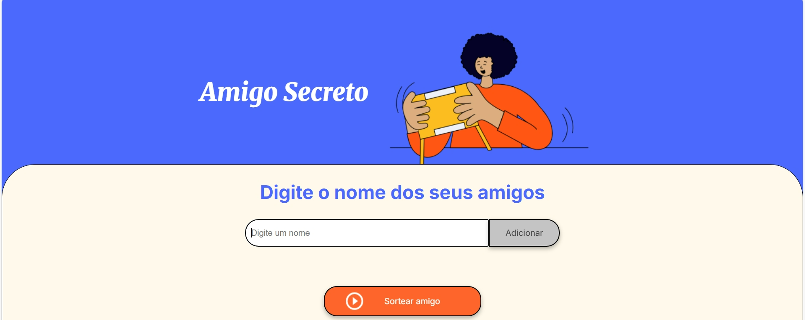

 <h1> 🎁 Amigo Secreto </h1>

Este projeto foi criado para facilitar o sorteio de Amigo Secreto de forma simples e divertida. Basta adicionar os nomes dos participantes e deixar que o sistema faça o sorteio por você!.

##  📸 Tela do Sorteio de Amigo Secreto
  

## 📌 Como funciona?

Digite o nome dos participantes e clique no botão "Adicionar".

Quando todos os nomes estiverem na lista, clique em "Sortear".

O site mostrará quem tirou quem no amigo secreto.

## 🛠 Tecnologias usadas

  
  
  

